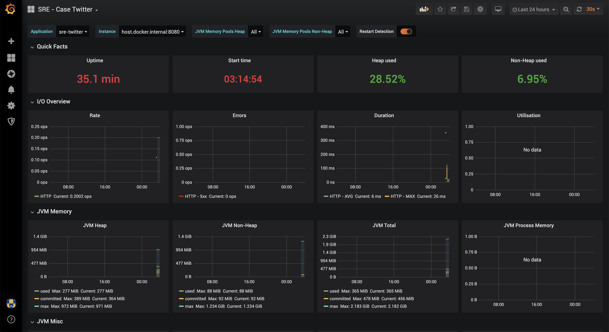

# SRE - Case Twitter
Case Twitter para SRE

## Demonstração

1. Kibana

2. Grafana

## Requisitos

- Docker
- Docker Compose
- Ambiente Unix/Linux

## Quick start

`./run.sh`

## API
Documentação: http://localhost:8080/swagger-ui.html

Requisitos:
1. Coletar uma amostra de até 100 tweets utilizando as Hashtags listadas abaixo
    1. openbanking
    2. remediation
    3. devops
    4. sre
    5. microservices
    6. observability
    7. oauth
    8. metrics
    9. logmonitoring
    10. opentracing
2. Disponibizar as seguintes estatísticas:
    1. Lista dos 5 usuários com maior número de seguidores da amostra coletada anteriormente
    2. Total de postagens, agrupados por hora do dia (independente da hashtag) 
    3. Total de postagens para cada hashtag por idioma/país do usuário que postou
 
## Métricas SRE
    
### Ferramentas utilizadas / Acessos

- Kibana: [http://localhost:5601](http://localhost:5601)
- Grafana: [http://localhost:3000](http://localhost:3000)  
    - User: sre
    - Password: sre
- Prometheus: [http://localhost:9090](http://localhost:9090)
- Zipkin: [http://localhost:9411](http://localhost:9411)
- ElasticSearch: [http://localhost:9200](http://localhost:9200)
- Logstash: `localhost:5044`
- Swagger: [http://localhost:8080/swagger-ui.html](http://localhost:8080/swagger-ui.html)
- Postman

## Desenvolvimento

Projeto desenvolvido utilizando:
    - Java
    - MongoDB
    - Spring Boot (Actuator, Sleuth, Zipkin, Mongo, entre outros)
    - Maven
    - Swagger
    - Logstash / Logback
    - Micrometer / Prometheus
    - Docker
    - Docker Compose
